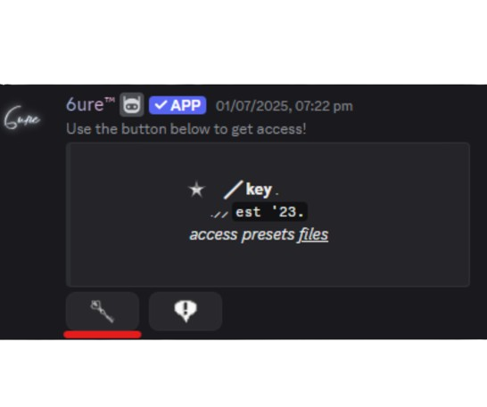
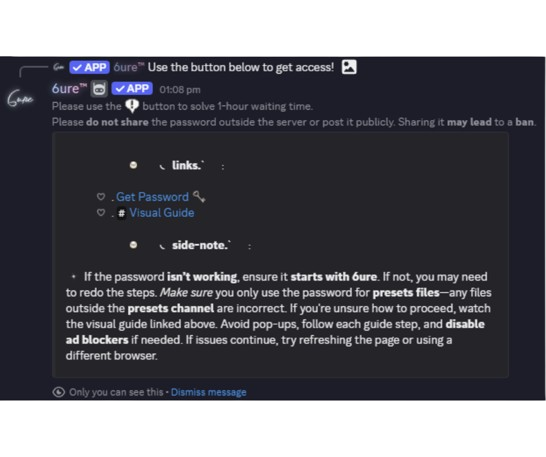

# Beginners Guide

## How to download presets from [`#・presets`](https://discord.com/channels/1118862694980788276/1340609745270345831)?

Downloading presets is an easy process, but it does require basic familiarity with Discord, and the ability to follow instructions carefully. Please ensure you understand how to navigate Discord before proceeding.
::: tip Must Read
- **You must install [WinRAR](https://www.win-rar.com/) (Windows) / [TheUnarchiver](https://theunarchiver.com/) (MacOS) in order to extract our files.**
:::

## How to Download {#download}

1. **Access the Presets Channel**  
Navigate to the [`#・presets`](https://discord.com/channels/1118862694980788276/1340609745270345831) channel on our Discord server.  
2. **Find Your Desired Preset**  
Browse through the available presets until you find the one you wish to download.  
3. **Proceed the Download**  
Once you have found a preset, click the **`Download`** button.  
{width=395px height=100px}  
4. **Get the Download Link**  
After clicking the download button, an **ephemeral message** will appear containing your download link. Click **`DOWNLOAD`** to be redirected to the download page.  
{width=395px height=100px}  
5. **Enter the Download Password**  
On the download page, you will be prompted to enter a password before proceeding. Input the password and click **Sign In**.  
{width=395px height=100px}
> If you do not have a password, please refer to the [How to Get Password](#password) section.  
7. **Complete the Download**  
Once signed in, your download will begin. Your file is now ready to use.  
{width=395px height=100px}   
> If you prefer visual guide, you can watch it here: https://streamable.com/mq1cg4  

## How to get Password {#password}

1. **Go to Access Channel**  
Go to the [`#・access`](https://discord.com/channels/1118862694980788276/1193416406587428924) channel in our Discord server.   
2. **Find the Access Message**  
You will see a message from 6ure™ (as shown below) with a **key button**.  
{width=395px height=175px}  
3. **Click the Key Button**  
Clicking the key button will bring up a second message containing links and instructions.  
{width=395px height=175px}  
4. **Get the Password or Tutorial**  
To obtain the password, click **`Get Password`** link.  
For step-by-step instructions, click **`Visual Guide`** link.  
> For brevity, we will not include the full tutorial here. The Visual Guide explains the process in detail.  
